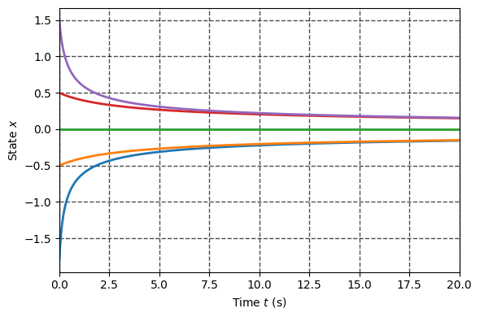

## **Fundamentals of Robot Control:**
### **Lecture 5: Stability of Nonlinear Systems and Fundamentals of Lyapunov Theory**

### **Introduction**
Perhaps the most useful and general approach for studying the stability of nonlinear
control systems is the theory introduced in the late 19th century by the Russian mathematician **Aleksandr Mikhailovich Lyapunov**. 

<p align="center">

</p>

Lyapunov's work, **"The General Problem of Motion Stability"** was published in 1892 and includes two methods for stability analysis:
* Linearization method
* Direct method

The **linearization** method draws conclusions about a nonlinear system's **local stability** around an equilibrium point from the stability properties of its linear approximation.

The direct method which we will study today **is not restricted to local motion**: and determines the stability
properties of a nonlinear system by constructing a scalar "energy-like" function for the system and examining the function's time variation.


```python
from utils import simulate, phase_portrait
```

### **Local stability and Linearization**

In the previous class we have studied the stability nearby equlibrium $\mathbf{x}_0$ of nonlinear systems in form:

$$
\dot{\mathbf{x}} = \mathbf{f}(\mathbf{x}),\quad \mathbf{x} \in \mathbb{R}^n
$$

Which we approximate by the linear system:

$$
 \dot{\tilde{\mathbf{x}}} =\frac{\partial\mathbf{f}}{\partial\mathbf{x}}\Bigr\rvert_{\mathbf{x}_e} \tilde{\mathbf{x}} = \mathbf{A}\tilde{\mathbf{x}}
$$

Then we conclude the stability of the original nonlinear system by expecting eigenvalues of $\mathbf{A}$

However there are several issues with this approach, which we will demonstrate by the following examples.

We begin with simple system:

$$
    \dot{x} = -x^3 
$$

It is obvious that this system has equlibrium $x=0$ and linearization nearby this equlibrium is Lyapunov stable, however as one can ensure either graphically or just by simulation, this system is stable: 


```python
def f(x,t):
    return -x**3

x_sol = simulate(f, [-1.8, -0.5, 0, 0.5, 1.5], tf=20, show_plot=True)
```


    

    


Consider now the familiar system:

$$
\dot{x} = -x + x^3 
$$

If one would check the stability of equlibrium $x=0$ the resulting linearizate system will be strictly stable.

Let us simulate the response from different initial conditions:


```python
def f(x,t):
    return -x+x**3

x_sol = simulate(f, [-1.00001, -0.5, 0, 0.5, 1.00001], tf=5, show_plot=True)
```


    

    


### **Local and Global Stability**
If stability is holds just for some set $\mathcal{R}$ of states, we call such stability to be **local** and region $\mathcal{R}$ is **domain of attraction**.   

If asymptotic (or exponential) stability holds for **any initial states**, the equilibrium point is said to be asymptotically (or exponentially) stable in the large. It is also called **globally** asymptotically (or exponentially) stable. 

## **Lyapunov's Direct Method**

The basic philosophy of Lyapunov's direct method is the mathematical extension of a
fundamental physical observation: if the total energy of a mechanical (or electrical)
system is continuously dissipated, then the system, whether linear or nonlinear, must
eventually settle down to an equilibrium point. Thus, we may conclude the stability of
a system by examining the variation of a single scalar function.


Specifically, let us consider the nonlinear mass-damper-spring system:

$$
    m\ddot{y}+b|\dot{y}|\dot{y} +k_0 y + k_1 y^3 = 0
$$

Assume that the mass is pulled away from the
natural length of the spring by a large distance, and then released. 
Will the resulting motion be stable? A physical intuition said that it should be.


Let us draw the phase portrait:


```python
m, b, k0, k1 = 1, 1, 1, 1 
def f(x,t):
    y = x[0]
    dy = x[1]
    ddy = -(b*abs(dy)*dy + k0*y + k1*y**3)/m
    return dy, ddy
phase_portrait(f, x_range=[4, 4], density=1.5) 
```


    

    


However if one will find the Jacobian:


```python
from sympy import Matrix, symbols, solve
from sympy.utilities.lambdify import lambdify

x = symbols(r'y \dot{y}', real = True)
f_sym = Matrix([f(x, 0)]).T

equlibriums = solve(f_sym, x)
print(f'Equilibria are:\n{equlibriums}\n')
jacobian = f_sym.jacobian(x)
print(f'Jacobian is:')
jacobian

```

    Equilibria are:
    [(0, 0)]
    
    Jacobian is:


$\displaystyle \left[\begin{matrix}0 & 1\\- 3 y^{2} - 1 & - \dot{y} \operatorname{sign}{\left(\dot{y} \right)} - \left|{\dot{y}}\right|\end{matrix}\right]$


```python
from numpy import array, real
from numpy.linalg import eig

jacobian_num = lambdify([x], jacobian)
for equlibrium in equlibriums:
    x_e = array(equlibrium, dtype='double')
    A = array(jacobian_num(x_e), dtype='double')
    print(f'The real part of poles for equlibrium {x_e} are: \n {real(eig(A)[0])} ')
```

    The real part of poles for equlibrium [0. 0.] are: 
     [ 0. -0.] 


Evaluation of the Jacobian around trivial equilibrium yields marginal stability of linearized system, thus we can't say anything on nonlinear system.  

### **Energy as Stability Criterion**
Let us consider the mechanical energy of the system above:
$$
    V(y, \dot{y}) = 
    \frac{1}{2}m\dot{y}^2 + \int_0^y(k_0 y + k_1 y^3)dy = 
    \frac{1}{2}m\dot{y}^2 + \frac{1}{2}k_0 y^2 + \frac{1}{4}k_1 y^4 
$$
Comparing the definitions of stability and mechanical energy, one can easily see some
relations between the mechanical energy and the stability concepts described earlier:

* zero energy corresponds to the equilibrium point ($y = 0, \dot{y}=0$)
* asymptotic stability implies the convergence of mechanical energy to zero
* instability is related to the growth of mechanical energy

These relations indicate that the **value of a scalar quantity**, the mechanical energy,
**indirectly reflects the magnitude of the state vector**.

The rate of energy during the system's motion is obtained easily by
differentiating:
$$
    \dot{V}(y, \dot{y}) = m \dot{y}\ddot{y} + (k_0 y + k_1 y^3)\dot{y} = -b | \dot{y}|^3
$$
this implies the energy of the system, starting from some initial value,
is continuously dissipated by the damper until the mass settles down, i.e. $y = 0$.

Physically, it is easy to see that the mass must finally settle down at the natural length
of the spring, because it is subjected to a non-zero spring force at any position other
than the natural length.

The direct method of Lyapunov is based on a generalization of the concepts in
the above mass-spring-damper system to more complex systems. Faced with a set of
nonlinear differential equations, the basic procedure of **Lyapunov's direct method** is to
generate a **scalar "energy-like" function** for the dynamical system, and examine the time
variation of that scalar function. In this way, conclusions may be drawn on the
**stability of the set of differential equations without using the difficult stability
definitions or requiring explicit knowledge of solutions**

### **Positive Definite Functions**

To begin with we will admit the two notable properties of the energy function above: 
* Strictly positive unless both state variables $\mathbf{x}$ are zero. 
* Monotonically decreasing when the variables $\mathbf{x}$ vary along system trajectories

In Lyapunov's direct method, the first property is formalized by the notion of **positive definite functions** (PD), and the second is formalized by the so-called **Lyapunov functions**.

---
A scalar continuous function $V(\mathbf{x})$ is said to be ***locally positive definite*** (LPD) in ball $\mathcal{B}_R = \{\mathbf{x} : \| \mathbf{x}\|\leq R\}$ if:
* $V(0) = 0$
* $V(\mathbf{x})>0,\ \forall \mathbf{x} \neq \mathbf{0}$ 

If above property holds $\mathbf{x} \in \mathbb{R}^n$ then $V(\mathbf{x})$ is said to be ***globally positive definite*** (GPD)

---

The above definition implies that the function V has a unique minimum at the origin.

For instance:
* The $V(\mathbf{x}) = \frac{1}{2}x_2^2 + 1-\cos{x_1}$ is locally positive definite 
* While $V(\mathbf{x}) = \frac{1}{2}x_1^2 + \frac{1}{2}x_2^2$ is globally positive definite 


### **Negative and Semi-Definiteness**

A few related concepts can be defined similarly, in a local or global sense, i.e., a
function $V(\mathbf{x})$ is negative definite if — $V(\mathbf{x})$ is positive definite; $V(\mathbf{x})$ is positive
semi-definite if $V(\mathbf{0}) = 0$ and $V(\mathbf{x}) \geq 0$ for $\mathbf{x} \neq 0$ $V(\mathbf{x})$ is negative semi-definite if - $V(\mathbf{x})$ is positive semi-definite. 

The prefix "semi" is used to reflect the possibility of $V$ being equal to zero eventhough $\mathbf{x}$ is not.


### **Local Stability via Direct Method**


If, in a ball $\mathcal{B}_R$, there exists a scalar function $V(\mathbf{x})$
with continuous first partial derivatives such that:

* $V(\mathbf{x})$ is positive definite (locally in $\mathcal{B}_R$)
* $\dot{V}(\mathbf{x})$ is negative semi-definite (locally in $\mathcal{B}_R$)


then the equilibrium point $\mathbf{0}$ is **stable**. If, actually, the derivative $\dot{V}(\mathbf{x})$ is locally
negative definite in $\mathcal{B}_R$, then the ***stability is asymptotic***.


Let us study the stability of the nonlinear system:
$$
\begin{cases}
\dot{x}_1 = x_1(x^2_1+x^2_2 - 2) -4 x_1 x^2_2  \\ 
\dot{x}_2 = 4 x^2_1 x_2 + x_2(x^2_1+x^2_2 - 2)
\end{cases}
$$

with following Lyapunov candidate:
$$
V(\mathbf{x}) = x_1^2 + x_2^2 
$$


```python
from sympy import simplify
x = symbols('x_1, x_2')
V_symb = x[0]**2 + x[1]**2
print(f'Lyapunov candidate:')
V_symb
```

    Lyapunov candidate:


$\displaystyle x_{1}^{2} + x_{2}^{2}$


One may use a chain rule in order to find $\dot{V}$ as follows:
$$
\dot{V} =  \sum_{i=1}^n\frac{\partial V}{\partial \mathbf{x}_i}\mathbf{\dot{x}}_i = \sum_{i=1}^n\frac{\partial V}{\partial \mathbf{x}_i}\boldsymbol{f}_i = \nabla V \cdot \boldsymbol{f}
$$


```python
grad_V = Matrix([V_symb]).jacobian(x)
print(f'Gradient of Lyapunov candidate:')
grad_V
```

    Gradient of Lyapunov candidate:


$\displaystyle \left[\begin{matrix}2 x_{1} & 2 x_{2}\end{matrix}\right]$


```python
f_symb = Matrix([x[0]*(x[0]**2 + x[1]**2 - 2) - 4*x[0]*x[1]**2,
                 4*x[0]**2 *x[1] +x[1]*(x[0]**2 + x[1]**2 - 2),])

dV = simplify(grad_V*f_symb)
print(f'Time derivative of Lyapunov candidate:')
dV[0]

```

    Time derivative of Lyapunov candidate:


$\displaystyle 2 x_{1}^{4} + 4 x_{1}^{2} x_{2}^{2} - 4 x_{1}^{2} + 2 x_{2}^{4} - 4 x_{2}^{2}$


The derivative above is locally N.D in the ball $\mathbf{x}^2_1 + \mathbf{x}^2_2 <2$


```python
# Create a numerical function from symbolic one
f_num = lambdify([x], f_symb)

def f(x, t):
    dx = f_num(x)[:,0]
    return dx

phase_portrait(f, x_range=[3, 2], density=1.5) 
```


    

    


### **Global Stability via Direct Method**


Assume that there exists a scalar function $V(\mathbf{x})$ with continuous first order derivatives such that:

* $V(\mathbf{x})$ is positive definite
* $\dot{V}(\mathbf{x})$ is negative definite
* $V(\mathbf{x})\rightarrow \infty$ as $\|\mathbf{x}\|\rightarrow \infty$

then the equilibrium at the origin is **globally asymptotically stable**


Consider the following system:
$$
\begin{cases}
\dot{x}_1 = -x_1 + x_2  \\ 
\dot{x}_2 = -x_1 - x_2^3
\end{cases}
$$

with following Lyapunov candidate:
$$
V(\mathbf{x}) = x_1^2 + x_2^2 
$$


```python
from sympy import simplify
x = symbols('x_1, x_2')
V_symb = x[0]**2 + x[1]**2
print(f'Lyapunov candidate:')
V_symb
```

    Lyapunov candidate:


$\displaystyle x_{1}^{2} + x_{2}^{2}$


```python
grad_V = Matrix([V_symb]).jacobian(x)
print(f'Gradient of Lyapunov candidate:')
grad_V
```

    Gradient of Lyapunov candidate:


$\displaystyle \left[\begin{matrix}2 x_{1} & 2 x_{2}\end{matrix}\right]$


```python
f_symb = Matrix([-x[0] + x[1],
                    -x[0] - x[1]**3])

dV = simplify(grad_V*f_symb) 
print(f'Time derivative of Lyapunov candidate:')
dV[0]
```

    Time derivative of Lyapunov candidate:


$\displaystyle - 2 x_{1}^{2} - 2 x_{2}^{4}$


```python
# Create a numerical function from symbolic one
f_num = lambdify([x], f_symb)

def f(x, t):
    dx = f_num(x)[:,0]
    return dx

x_sol = simulate(f, [[-1,-1]], tf = 10, show_plot=True)
```


    

    


```python
phase_portrait(f, x_range=[2, 3], density=1.5) 
```


    

    


### **Geometrical Interpretation**

<p align="center">

</p>

### **Lyapunov Functions for LTI systems**

The direct Lyapunov method can be in fact applied to linear systems as well: 
$$
    \dot{\mathbf{x}} = \mathbf{A}\mathbf{x}
$$

Consider the quadratic Lyapunov candidate:
$$
    V = \mathbf{x}^T\mathbf{P}\mathbf{x}
$$

with time derivative:
$$
    \dot{V} = \mathbf{x}^T(\mathbf{A}^T\mathbf{P} + \mathbf{A}\mathbf{P})\mathbf{x} = -\mathbf{x}^T \mathbf{Q} \mathbf{x}
$$

where $\mathbf{Q}$ is P.D. 

One can conclude that the LTI system is stable if there is P.D solution of matrix equation:
$$
    \mathbf{A}^T\mathbf{P} + \mathbf{A}\mathbf{P} = -\mathbf{Q}
$$


As example consider the linear system:


```python
A = array([[0, 4],
           [-8, -12]])

print(f'Poles of:\n {A} \nare:\n{eig(A)[0]}')
```

    Poles of:
     [[  0   4]
     [ -8 -12]] 
    are:
    [-4. -8.]


```python
from scipy.linalg import solve_continuous_lyapunov as lyap
Q = array([[1, 0],
           [0, 1]])
P = lyap(A.T, -Q)
print(f'The solution of Lyapunov equation is:\n{P}')
print(f'\nThe eigen values are:\n{eig(P)[0]}')

```

    The solution of Lyapunov equation is:
    [[0.3125 0.0625]
     [0.0625 0.0625]]
    
    The eigen values are:
    [0.32725425 0.04774575]

